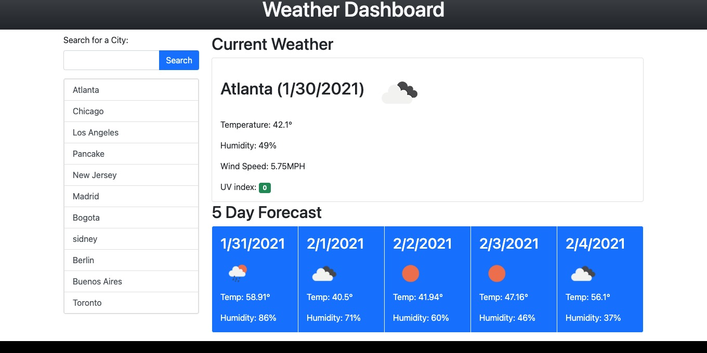

# weather-dashboard

## Introduction

This app is intended to show the current weather of a city as well as the forecast for the next 5 days.
We Take the input from the user (name of the city) and then we call the OpenWeatherMap API to get all of our data
We display temperature, humidity and an icon for the both the current and the future weather. We also show the UV index for the current weather with a color representing how favorable or severe it is.

## Link to app
[Weather Dashboard](https://jpecheverryp.github.io/weather-dashboard/)

## Mock-Up
